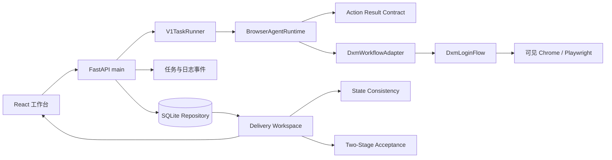

# DXM 当前运行时架构

更新时间：2026-07-17

## 设计目标

运行时只允许两种受控真实 mutation：Stage A `claim_only` 与 Stage B `single_save`。它们必须连接成同商品、同证据链的两段式流程；发布、批量和无人值守不在当前 release surface。

## 组件关系



Electron 桌面壳负责启动和校验本机后端身份，再加载前端。后端不是每个动作新建一个浏览器；Browser Agent 维护受控生命周期，`DxmLoginFlow` 持有可见 browser/context/page，步骤间通过命令和结构化结果推进。

## 两段式状态边界

### Stage A：`claim_only`

- 输入是店小秘已有待认领商品的稳定来源和目标提示，不允许把本地 fixture 当真实来源。
- 只运行到认领和商品箱验证，不打开编辑器、不触发保存。
- 成功事实必须包含来源身份、店铺/商品绑定、认领动作结果和商品箱验证。

### Stage B：`single_save`

- 创建任务时即快照 Stage A 的任务、商品、店铺、来源和商品箱证明。
- 运行前后都要验证快照没有漂移，模板是已存在且由用户选择/确认的模板。
- 只允许规范“保存”动作；成功需要保存回包和独立 `published=false` 证明。

## 审批与 mutation 命令

每个真实阶段都有独立服务端审批租约。读 API 不返回可重放 token；runner 在接近真实 mutation 时重新验证已消费租约，而不是只依赖任务启动时的检查。

Browser Agent 命令应绑定：

- `command_id` 与稳定的 mutation scope/id；
- task/job、mode、state、action 与 ordinal；
- runtime identity、browser session 和生命周期 generation；
- expected page、精确 target binding；
- deadline、cancel epoch 和审批租约事实。

worker 只接受 state/action/page 契约允许的组合，并通过 `dxm.action-result.v1` 校验结构化结果和证据描述。空 readback、模糊成功文案或与当前 state 不匹配的结果不能推进状态机。

## 持久化 mutation ledger

真实浏览器系统不能依赖进程内幂等集合来声明跨重启 exactly-once。当前生产门禁要求本地持久化的 at-most-once 自动派发：

```text
PENDING -> DISPATCHING -> DISPATCHED
                  \\-> UNKNOWN  (崩溃、超时或结果不确定)
```

- mutation scope 必须来自稳定审批/任务事实，不能包含每次重启都会变化的 runtime ID。
- `DISPATCHING` 的进程恢复结果是 `UNKNOWN`，不得自动重试。
- `DISPATCHED` 只表示 ledger 已记录一次派发结果；业务 postcondition、保存回包和未发布证明仍由 action-result/runner/交付验收独立验证。
- 只有人工对账能解除 `UNKNOWN`；READY 聚合必须把它当 blocker。
- 浏览器操作在锁外执行；锁只用于短原子检查/状态迁移，避免 cancel、shutdown、takeover 自锁。

## 动作前实时复核

审批通过后、真正点击前仍需重新读取并比较：

1. 当前 lifecycle owner/generation；
2. browser session identity；
3. 精确页面 URL/页面类型；
4. 目标行、按钮或编辑对象的绑定 hash；
5. 审批租约、deadline 和 cancel epoch；
6. ledger 原子状态。

任一变化都在点击前失败关闭。动作完成后的 postcondition 只能证明结果，不能弥补动作前身份缺失。

## 生命周期并发

- takeover 产生新的 owner/generation；旧 resume/probe 完成时不得把新 owner 覆盖为 idle。
- shutdown 对同一会话必须 single-flight，重复请求不能重复关闭 browser/context/page。
- 有 mutation 正在浏览器侧执行时，cancel/shutdown/takeover 应迅速记录意图并返回 pending/人工复核状态，不能等待外部操作无限结束。
- late result 只能在 owner、task/job 和数据库状态仍匹配时提交；否则转人工复核。

## 交付真相链

```text
task/job facts
  + separate Stage A/B approval leases
  + runtime/session/page/target identity
  + action-result evidence
  + mutation ledger reconciliation
  + dxm_state_consistency.v1
  + dxm_two_stage_acceptance.v1
  + clean Git/build/portable identity
  + fresh L2 and same-product live canary
  = production READY
```

这是一组 AND 条件，不是可替换证据。当前分支尚无同 HEAD portable 与真实两段式现场闭环，因此当前生产结论仍为 `BLOCKED`。
