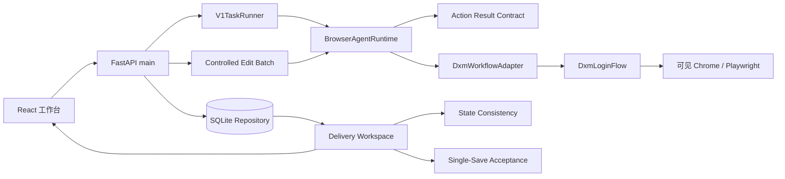

# DXM 当前运行时架构

更新时间：2026-07-22

## 设计目标

运行时只允许对店小秘商品箱中的现有商品执行受控保存。单商品使用 `single_save`；多商品使用 `controlled_edit_batch` 冻结范围后串行派发。系统不会在店小秘创建或搬运商品、不执行认领、不发布，也不开放旧 `batch_save` 无人值守任务；本地数据库只保存实时商品箱身份投影和证据。

## 组件关系



Electron 桌面壳启动并校验本机后端身份后加载前端。Browser Agent 维护受控 browser/context/page 生命周期；步骤之间通过命令与结构化结果推进，而不是每步重开浏览器。

## 商品箱目标冻结

`POST /api/dxm/draft-box/scope-snapshots` 先对当前可见商品箱执行零写入 DOM 捕获。通过严格 scope contract 后，Repository 写入不可变范围证据，并按 `store id + stable_record_key` upsert 本地 `dxm_draft_box/ready_for_edit` 身份投影；响应返回 `store_id` 和 `local_product_id`。没有唯一已登记店铺、稳定身份或证据时不会创建可执行商品。

`Repository.create_task(mode="single_save")` 只接受一个商品箱商品，并在任务创建事务内冻结 `product_box_snapshot`：

- product id、标题和当前可编辑状态；
- store id 与 store name；
- 规范化来源 URL 集合；
- 精确 `target_identity` 及其 hash；
- 捕获时间与不可变商品箱证据引用；
- 完整快照 fingerprint。

任务启动、保存动作前和交付验收都会重新验证快照。商品、店铺、来源、目标、证据或 fingerprint 任一漂移都失败关闭；系统不会回退到标题模糊匹配。

## 单商品保存状态边界

`single_save` 从 `OPEN_DRAFT_LIST` 开始，定位冻结商品，打开编辑页，补齐已确认配置，执行保存前发布隔离，然后只点击唯一的“保存”。成功必须同时证明：

- 服务端批准租约已消费；
- 点击对象是当前冻结目标的唯一保存按钮；
- mutation ledger 已记录唯一派发；
- DXM 保存接口返回结构化成功；
- 页面出现新的或变化后的保存成功状态；
- 随后的独立读回证明商品仍为未发布；
- 保存和未发布使用不同、按时序排列的不可变证据文件。

## 受控整批

`controlled_edit_batch` 不复用旧 `batch_save` 调度器。它在批准时冻结商品箱当前可见范围和顺序，并遵守：

- 一次批准、严格串行、全局并发为 1；
- 每个商品派发前签发 60 秒一次性 mutation grant；
- 保存前零写入失败可隔离到单个商品；
- 已派发或结果不确定时立即停批；
- 每个商品独立保存回包和未发布证明；
- `UNKNOWN` 只能人工对账，不能自动重试。

## 审批与命令契约

真实保存命令绑定 task/job 或 batch/item、mode、state、action、ordinal、runtime identity、browser session、lifecycle generation、精确页面、冻结目标、deadline、cancel epoch 与批准事实。

worker 只接受 state/action/page 契约允许的组合，并通过 `dxm.action-result.v1` 校验结构化结果。空 readback、模糊成功文案、复用保存截图充当未发布证明，或与当前 state 不匹配的结果都不能推进状态机。

## 持久化 mutation ledger

```text
PENDING -> DISPATCHING -> DISPATCHED
                  \-> UNKNOWN  (崩溃、超时或结果不确定)
```

- mutation scope 来自稳定任务或批次事实，不依赖每次重启变化的 runtime ID。
- `DISPATCHING` 的进程恢复结果是 `UNKNOWN`，不得自动重试。
- `DISPATCHED` 仅证明发生过一次派发；业务结果仍由 action result、报告和验收独立证明。
- 浏览器操作在锁外执行；锁只保护短原子状态迁移，避免 cancel/shutdown/takeover 自锁。

## 动作前实时复核

真正点击前必须再次比较 lifecycle owner/generation、browser session、精确页面、冻结商品目标、店铺、来源、批准租约、deadline、cancel epoch 和 ledger 状态。任何变化都在点击前停止。

## 交付真相链

```text
task/job or batch/item facts
  + immutable product_box_snapshot
  + consumed server approval
  + runtime/session/page/target identity
  + action-result evidence
  + mutation ledger reconciliation
  + dxm_state_consistency.v1
  + dxm_single_save_acceptance.v1
  + clean Git/build/portable identity
  + fresh draft_box L2 and live save-only canary
  = declared-scope READY
```

这些条件是 AND 关系。受控整批还必须逐商品满足同等保存与未发布证据，并通过停批/人工对账验收。
